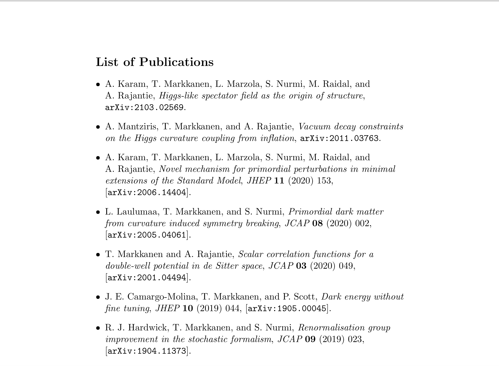

# pubslist-generator


## Description

The need for a list of publications in pdf from is ubiquitous in high energy physics. This script uses the [INSPIRE REST API](https://github.com/inspirehep/rest-api-doc) for gathering the publication data and produces a pdf file via *LaTeX* and *BibTeX*. A unique INSPIRE identifier (BAI) is required as input.

## BAI

From [https://inspirehep.net/help](https://inspirehep.net/help/knowledge-base/inspire-paper-search/): "Assuming the author’s claimed all of their papers on INSPIRE, anyone using the author’s BAI will find the complete list of that person’s work. An author’s BAI is easily retrievable from the author’s profile page. It looks something like: 'M.Smith.1' or 'J.L.Greenwood.2'."

## Usage
Execute the bash script **pubs.sh** and provide to prompted inputs ({inspire ID}, {y,n}). Example:

```console
foo@bar:~$ bash pubs.sh
Inspire author identifier: tommi.markkanen.1
Include unpublished (y/n): y
```
The **pubslist.pdf** is accesible in the folder **files/**
```console
foo@bar:~$ {PDF_READER} ./files/publist.pdf
```
**files/** also contains the **pubslist.tex** and **biblio.bib** allowing customization.

## Dependencies
Uses:
- Bash
- pdfLaTeX
- BibTeX
- Python
  - pandas
  - requests

## Note on publication ordering
The items are organized in descending manner (newest first) with the arXiv
upload date as the primary date. If no arXiv entry exists the year entry of the bibTeX item is used as the date instead with January as the default month. If also the entry for the year is missing the item is simply placed at the end of the list and there is no ordering for the set of items with no date information available.   

## Possible issues
Retrieval of records with a very large number of items (around 1000) has a tendency of failing. Also, some BibTeX entries provided by [INSPIRE REST API](https://github.com/inspirehep/rest-api-doc) contain invalid LaTeX formatting (seems to be more common for authors working in particle physics phenomenology). In such a case one must change the invalid lines in the **biblio.bib** file manually and recompile **pubslist.tex**.
